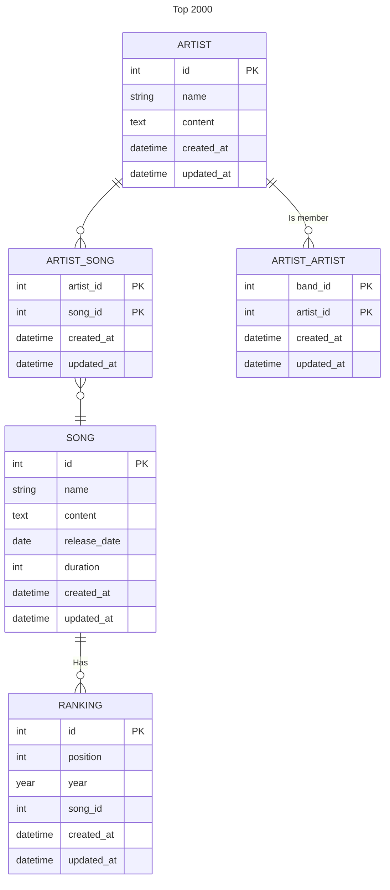

# Entity Relationship Diagram

```mermaid
---
title: Top 2000
---
erDiagram
    ARTIST ||--o{ ARTIST_SONG : ""
    ARTIST ||--o{ ARTIST_ARTIST : "Is member"
    ARTIST_SONG }o--|| SONG : ""
    SONG ||--o{ RANKING : "Has"

    ARTIST {
        int id PK
        string name
        text content
        datetime created_at
        datetime updated_at
    }

    %% If the artist is a band, the members can be added here
    ARTIST_ARTIST {
        int band_id PK
        int artist_id PK
        datetime created_at
        datetime updated_at
    }

    ARTIST_SONG {
        int artist_id PK
        int song_id PK
        datetime created_at
        datetime updated_at
    }

    SONG {
        int id PK
        string name
        text content
        date release_date
        int duration
        datetime created_at
        datetime updated_at
    }

    RANKING {
        int id PK
        int position
        year year
        int song_id
        datetime created_at
        datetime updated_at
    }
```
